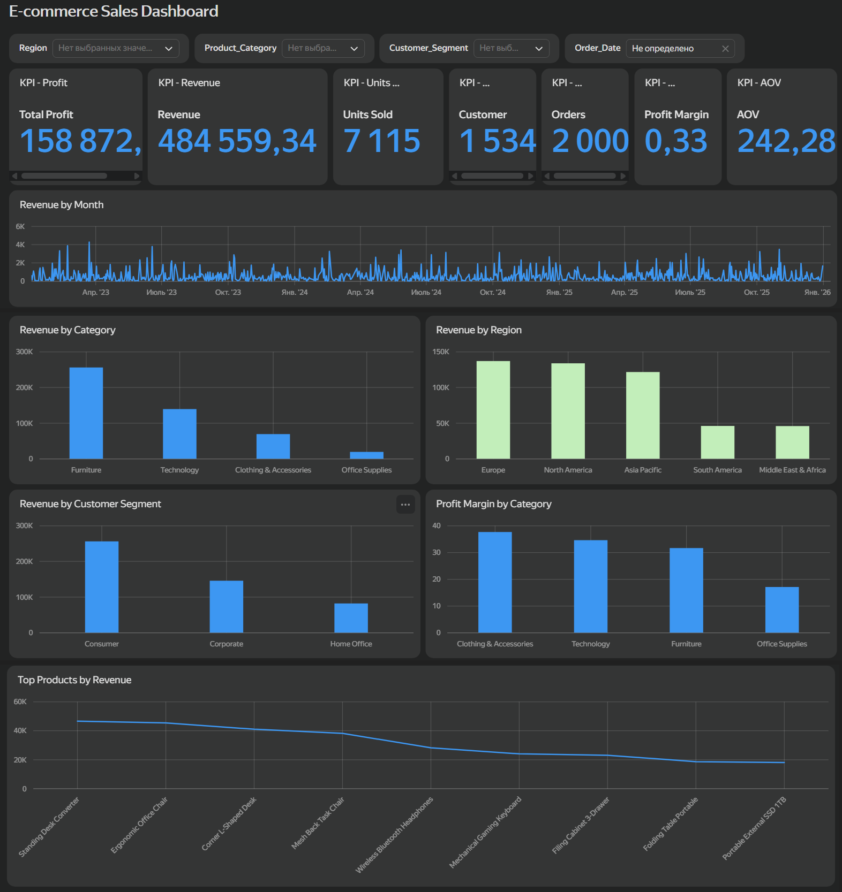

# Data Analyst Portfolio

Портфолио для позиции **Junior Data Analyst / Data Analyst Intern**. Здесь собраны проекты по Python/Pandas, PostgreSQL, A/B testing, маркетинговой аналитике и BI в Yandex DataLens.

## Ключевые кейсы

### 1. E-commerce Analytics Case — 2023–2025
Один сквозной кейс, реализованный несколькими инструментами:
- [Python Sales Analysis](./01_sales_analysis/) — data quality, EDA и KPI;
- [SQL Analysis](./03_sql_analysis/) — аналитические запросы PostgreSQL;
- [Yandex DataLens Dashboard](./05_dashboard/) — интерактивный BI;
- [E-commerce 360](./06_final_project/) — итоговая бизнес-интерпретация и воспроизводимые результаты.

**Проверенные KPI:** 2 000 заказов · Revenue 484 559,34 · Profit 158 872,32 · Margin 32,79% · AOV 242,28.

### 2. A/B Testing — Cookie Cats
[Открыть проект](./02_ab_testing/)

Проверка влияния изменения progression gate на retention: hypotheses, chi-square, confidence intervals и bootstrap.

- Day-1: 44,82% vs 44,23%, p = 0,0755;
- Day-7: 19,02% vs 18,20%, p = 0,0016.

### 3. Marketing Analytics — 2024
[Открыть проект](./04_marketing_analysis/)

Анализ 1 000 synthetic/educational campaign observations: CTR, CPC, weighted ROI, conversion rate и сегментация. Ограничения данных явно отделены от рассчитанных метрик.

### 4. Relational SQL Business Case
[Открыть проект](./07_relational_sql_case/)

Небольшая нормализованная e-commerce модель с customers, products, orders, order_items и payments. Демонстрирует JOIN, CASE, CTE, оконные функции, ranking и бизнес-запросы.

## Технологии
**Python:** Pandas, NumPy, SciPy, Statsmodels  
**SQL:** PostgreSQL, JOIN, CTE, CASE, subqueries, window functions  
**BI:** Yandex DataLens, calculated fields, interactive filters  
**Analytics:** EDA, data quality, KPI, A/B testing, confidence intervals, segmentation, business interpretation

## Подход к качеству
- результаты рассчитываются из исходных данных, а не вводятся вручную;
- synthetic/educational datasets явно маркируются;
- ограничения данных описываются рядом с выводами;
- для основных бизнес-кейсов используются данные 2023+;
- SQL/Python и производные результаты хранятся воспроизводимо;
- автоматическая QA-проверка описана в GitHub Actions.

## Навигация
| Проект | Основной фокус |
|---|---|
| [01 Sales Analysis](./01_sales_analysis/) | Python / Pandas / EDA |
| [02 A/B Testing](./02_ab_testing/) | Statistics / Experimentation |
| [03 SQL Analysis](./03_sql_analysis/) | PostgreSQL analytics |
| [04 Marketing Analysis](./04_marketing_analysis/) | Marketing KPI |
| [05 DataLens Dashboard](./05_dashboard/) | BI / Dashboard |
| [06 E-commerce 360](./06_final_project/) | End-to-end analytics |
| [07 Relational SQL Case](./07_relational_sql_case/) | JOIN / CASE / Window functions |

> Cookie Cats используется как методологический benchmark-кейс; его ценность — в статистической постановке, а не в актуальности рыночных показателей.
